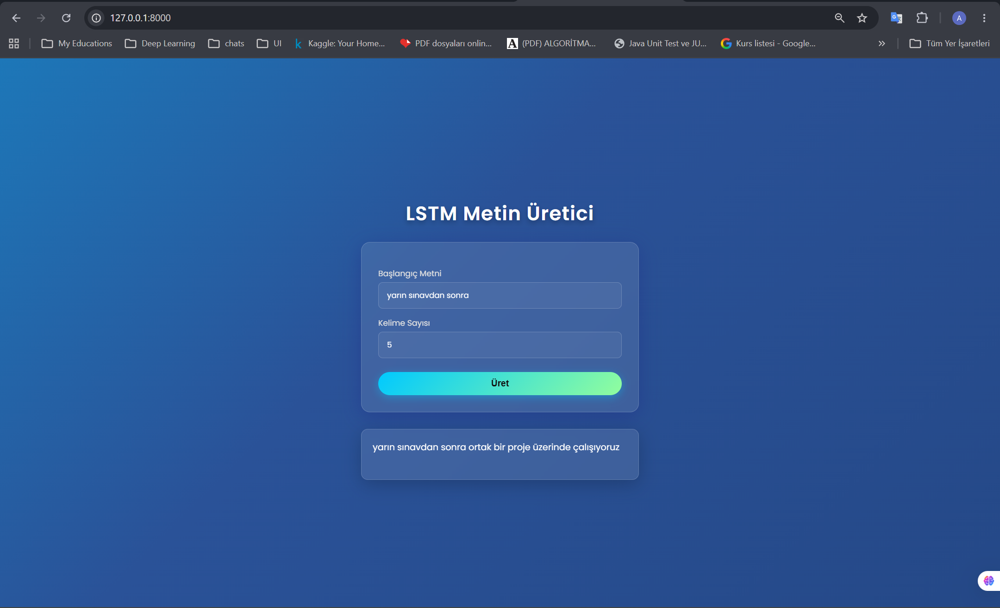

# 📖 LSTM ile Türkçe Metin Üretimi (Text Generation)

Bu proje, Türkçe günlük konuşma cümlelerini kullanarak **sonraki kelimeyi tahmin eden** ve verilen bir başlangıç ifadesine göre metin üreten **Derin Öğrenme (LSTM)** tabanlı bir NLP uygulamasıdır.  

Sadece bir yapay zeka modeli olmakla kalmaz; FastAPI ile geliştirilmiş güçlü bir back-end ve "Glassmorphism" (buzlu cam) tasarım diline sahip modern, animasyonlu bir web arayüzü sunar. Kullanıcılar tarayıcı üzerinden dinamik bir şekilde modelle etkileşime geçebilir ve anında sonuç alabilirler.

---

## ✨ Öne Çıkan Özellikler
- **Gelişmiş Metin Tahmini:** Keras/TensorFlow ile eğitilmiş LSTM modeli sayesinde bağlama uygun Türkçe kelime üretimi.
- **Modern ve Dinamik Arayüz:** Kullanıcı deneyimini (UX) ön planda tutan, animasyonlu arka plan ve yarı saydam (glassmorphism) form tasarımı.
- **Yüksek Performanslı API:** Asenkron çalışan, Swagger dokümantasyonuna sahip FastAPI mimarisi.
- **Konteynerizasyon:** Docker ile tüm bağımlılıkların izole edilmesi ve kolay dağıtım.
- **CORS Desteği:** İleride farklı Front-end (React/Vue vb.) veya Mobil (React Native) istemcilerle sorunsuz haberleşme altyapısı.

---

## 🚀 Kullanılan Teknolojiler
- **Back-End:** Python 3.10, FastAPI, Uvicorn
- **Yapay Zeka (AI):** TensorFlow / Keras, NumPy
- **Front-End:** HTML5, CSS3 (Modern UI/UX Animasyonları), Vanilla JavaScript
- **DevOps:** Docker

---

## 📂 Proje Yapısı
```text
├── train_lstm.py          # Veri işleme, model eğitimi ve modeli kaydetme adımları.
├── requirements.txt       # Projenin çalışması için gereken Python kütüphaneleri.
├── Dockerfile             # Konteyner ortam konfigürasyonu.
├── app/
│   ├── main.py            # FastAPI uygulamasının giriş noktası ve ayarları.
│   ├── routes/            # API endpoint’leri (örn: /generate/).
│   ├── services/          # Eğitilmiş modelin yüklenmesi ve tahmin fonksiyonları.
│   ├── templates/         # Jinja2 HTML şablonları (index.html).
│   └── static/            # CSS, JS ve resim dosyaları.
└── images/                # Projeye ait ekran görüntüleri.


## 📸 Ekran Görüntüsü


